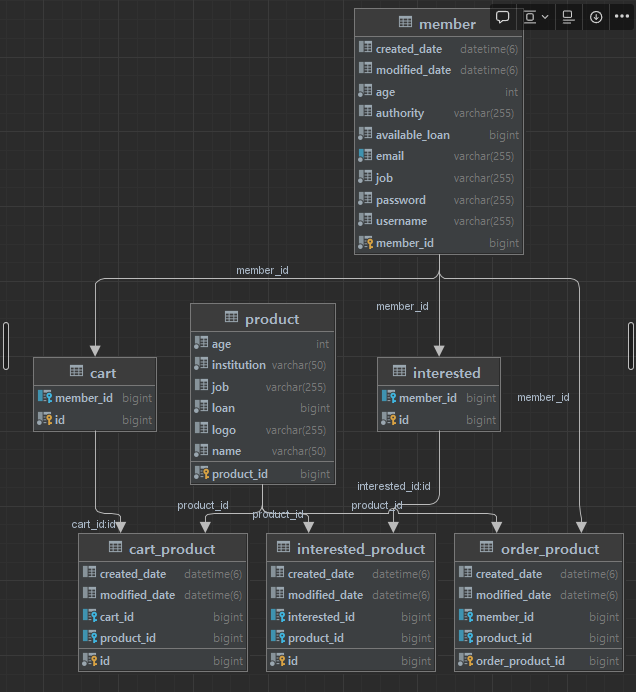
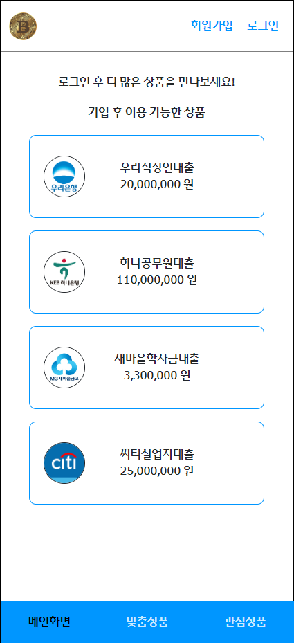
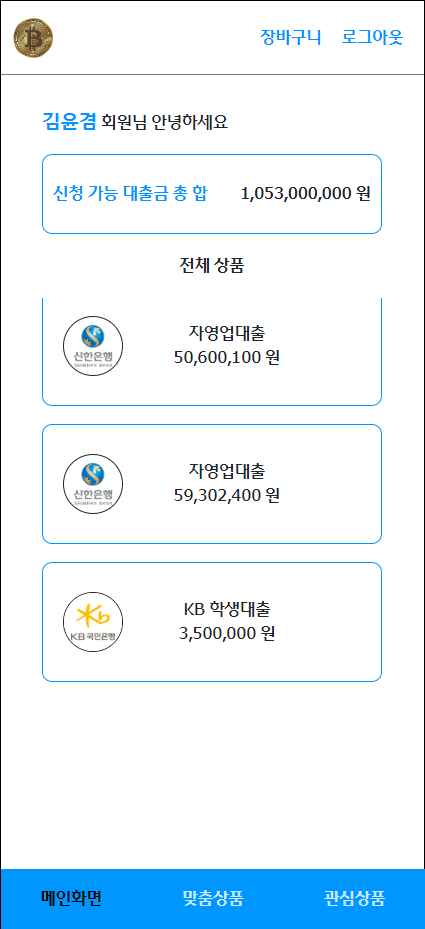
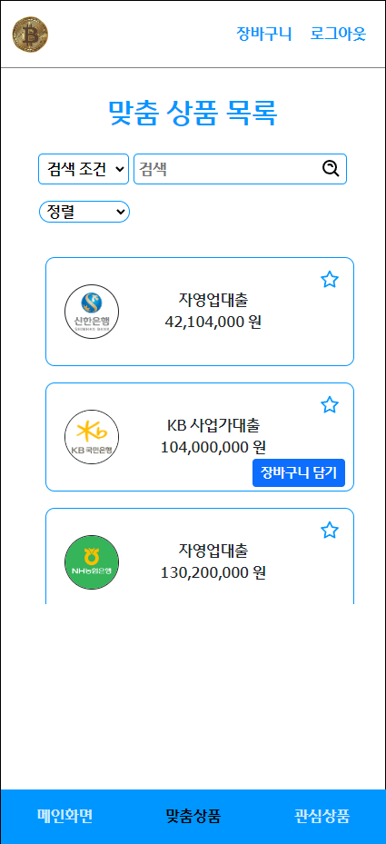

# 💎 금융상품 쇼핑몰 만들기

https://mango-tower-9f1.notion.site/7670e6d5a49d489f806ea2fb271d4fcb

1. [Development](#development)
2. [Deployment](#deployment )
3. [Dependency](#dependency )
4. [API specification](#api-specification)
5. [DB](#db)
6. [Result](#result)

<br>

## 👦 Back-End Team

>팀장: **김윤겸(_yoongyum_)**

>팀원: **김현준(khjun723), 장호준(ho-jun97), 김성준(Meringue-KIm)**

>프론트 팀 Repo: https://github.com/davidktlee/FC-ToyProject-Team3

<br>

## Development

- **IntelliJ**

- **openJDK** `11.0.10`

- **Spring boot** `2.7.3`

<br>

## Deployment

- **EC2 Instance** `free tier`
    - **ubuntu** `22.04 LTS`
    - **Elastic IP**
- **CloudFront**
- **Amazon Certificate Manager**(ACM)
- **Route 53**
    - `www.jaksim3.com`
    - `api.jaksim3.com`
- **Docker** `20.10.17`
    - **MySQL** `8.0.22`
    - **Docker Hub** - _yoongyum/spring-cicd_
        - https://hub.docker.com/?code=9uBU6bwy9K7BwwqZwqRnkaDEJvEnKOTlrLTbk-d7pWiMP&state=OFc2R21VY2NXUV9qYUxEVVkuT2IuZlRWRDZ5NloyMVl0NXlyblNGc0Nkdg%3D%3D

### `Server Deployment Structure`


<br>

## Dependency

- ***Spring Web***
- ***Spring DevTools***
- ***Spring Data JPA***
- ***Spring Security***
- ***Lombok***
- ***JWT***
- ***Swagger***
- ***MySQL Connector***

<br>

## API specification

https://www.jaksim3.com/swagger-ui.html

> **/auth/login** 로그인 요청 `POST`
>
>**/auth/signup** 회원 가입 `POST`

> **/member** 내 정보 `GET`

> **/products** 금융상품 전체 목록 `GET`
>
>**/products/customization** 맞춤 금융상품 목록 `GET`
>
>**/products/search** 금융상품 검색 `POST`

> **/carts** 장바구니 목록 `GET`
>
>**/carts** 장바구니 비우기 `DELETE`
>
>**/carts/{productId}** 장바구니 담기 `POST`
>
>**/carts/{productId}** 장바구니에서 빼기 `DELETE`

>**/interests** 관심상품 목록 `GET`
>
>**/interests** 관심상품 비우기 `DELETE`
> 
> **/interests/{productId}** 관심상품 추가 `POST`
> 
> **/interests/{productId}** 관심상품 삭제 `DELETE`

> **/orders/{productId}** 금융상품 주문 신청 `POST`


<br>

## DB

<details>
<summary>DDL</summary>
<div markdown="1">

```mysql
drop table if exists cart_product cascade;
drop table if exists cart cascade;
drop table if exists interested_product cascade;
drop table if exists interested cascade;
drop table if exists order_product cascade;
drop table if exists product cascade;
drop table if exists member cascade;

create table member
(
    member_id      bigint auto_increment
        primary key,
    created_date   datetime(6)  null,
    modified_date  datetime(6)  null,
    age            int          not null,
    authority      varchar(255) null,
    available_loan bigint       not null,
    email          varchar(255) not null,
    job            varchar(255) not null,
    password       varchar(255) not null,
    username       varchar(255) not null,
    constraint UK_mbmcqelty0fbrvxp1q58dn57t
        unique (email)
);

create table product
(
    product_id  bigint auto_increment
        primary key,
    age         int          not null,
    institution varchar(50)  not null,
    job         varchar(255) null,
    loan        bigint       not null,
    logo        varchar(255) null,
    name        varchar(50)  not null
);

create table order_product
(
    order_product_id bigint auto_increment
        primary key,
    created_date     datetime(6) null,
    modified_date    datetime(6) null,
    member_id        bigint      null,
    product_id       bigint      null,
    constraint FKhnfgqyjx3i80qoymrssls3kno
        foreign key (product_id) references product (product_id),
    constraint FKk01qiu5b3r035sni65tmgph8d
        foreign key (member_id) references member (member_id)
);

create table cart
(
    id        bigint auto_increment
        primary key,
    member_id bigint null,
    constraint FKix170nytunweovf2v9137mx2o
        foreign key (member_id) references member (member_id)
);

create table cart_product
(
    id            bigint auto_increment
        primary key,
    created_date  datetime(6) null,
    modified_date datetime(6) null,
    cart_id       bigint      null,
    product_id    bigint      null,
    constraint FK2kdlr8hs2bwl14u8oop49vrxi
        foreign key (product_id) references product (product_id),
    constraint FKlv5x4iresnv4xspvomrwd8ej9
        foreign key (cart_id) references cart (id)
);

create table interested
(
    id        bigint auto_increment
        primary key,
    member_id bigint null,
    constraint FKi3swcjel7esh5q91xvni6an6b
        foreign key (member_id) references member (member_id)
);

create table interested_product
(
    id            bigint auto_increment
        primary key,
    created_date  datetime(6) null,
    modified_date datetime(6) null,
    interested_id bigint      null,
    product_id    bigint      null,
    constraint FK6g3jxf32xrx4jbs2wkka5vx1a
        foreign key (product_id) references product (product_id),
    constraint FK7pkibgkr5t2rndjyhxg7yyyq2
        foreign key (interested_id) references interested (id)
);
```

</div>
</details>



<br>

## Result

프론트 팀에서 배포해주신 Application

https://vermillion-shortbread-f46c4f.netlify.app/




### 역할

- 👑**김윤겸**
  - Spring Security
  - 주문 신청 로직
    - 주문 신청 시 신청가능 대출금 합 계산
  - 서버 배포 
  - CI/CD
- **김현준**
  - Swagger
  - 상품 추천, 검색
- 👲**장호준**
  - jwt
  - 관심 등록, 삭제, 목록, 전체삭제
  - 장바구니 등록, 삭제, 목록, 전체삭제